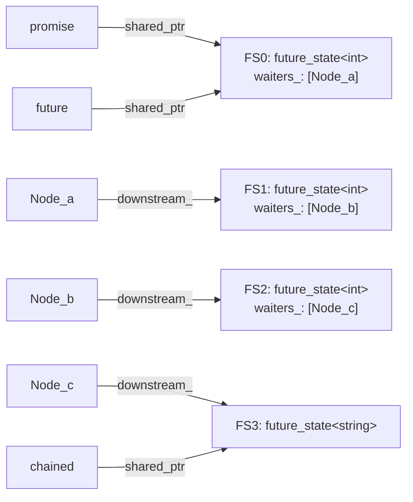

# Allocation patterns

Everything owned in `est` — a `future_state<T>`'s control block, a
continuation node, a timer's callback node — goes through one explicit
`std::pmr::polymorphic_allocator<std::byte>`: the one an `est::loop` was
built with (`loop.allocator()`). There's no hidden global `new`/`delete`
anywhere in the hot path, and no type-erased wrapper (a `std::function`, a
`std::move_only_function`) that might allocate through its own internal
strategy instead of the caller's chosen memory resource. This page traces
exactly what gets allocated, when, and by whom — the answer to "what does a
complex `.then()` chain actually cost."

## The two allocation primitives

1. **`est::shared_ptr<T>::make(allocator, args...)`** — *one* allocation
   either way, though what that allocation actually holds depends on `T`:
   for most `T`, a `control_block` combining the ref count, the
   allocator, and `T` itself; for a `T` that inherits `est::ref_counted`
   instead (`future_state<T>` is the one `T` in this codebase that does —
   see [Architecture](Architecture.md)), `shared_ptr<T>` allocates `T`
   *directly*, with no separate wrapping struct at all — `T` carries its
   own ref count and allocator right on itself, via `ref_counted`. Either
   way this is what every `future_state<T>` is built through
   (`make_promise_future()`, and every `then()` call's downstream state),
   and either way there's never a second, separate control-block
   allocation to worry about, unlike `std::shared_ptr<T>` built via `new
   T` then wrapped — `make()` is already the `make_shared`-equivalent
   path, always.
2. **`new Concrete(args...)`** — a *direct*, un-shared allocation for a
   continuation or timer node (`concrete_continuation<Fn, U>`,
   `est:promise`'s `sleep_resume_node`/`promise_resume_node<T>`, the latter
   shared with `est:sync.event`). These are
   never wrapped in a `shared_ptr` — a node has exactly one owner at a
   time (first the `future_state` it's pending on, then the loop's
   ready-queue or pending-timer list), so plain ownership-by-pointer plus
   a virtual destructor is enough. Every concrete node type has its own
   `operator new`/`operator delete`, resolving `est::current_allocator()`
   fresh (the same pattern a coroutine frame's own allocation uses) -
   inherited from `detail::current_allocator_new_delete<T>`
   (`est:util.current_loop`) rather than hand-rolled per class. See
   [Continuation Node Mechanism](Continuation-Node-Mechanism.md) for why
   that mixin can't instead live on `ready_node`/`timer_node` themselves,
   and why it's what makes `delete` through a `ready_node*`/`timer_node*`
   base pointer correctly sized for the *actual* derived type.

## Allocation cost per operation

| Operation | Allocations | What they are |
|---|---|---|
| `make_promise_future<T>()` | **1** | `future_state<T>` itself (no separate control block - see above) |
| `future<T>::then(fn)` (plain, non-flattening) | **2** | the downstream `future_state<U>`, plus the `concrete_continuation<Fn, U>` node |
| `est::sleep_for()` / `sleep_until()` | **2** | `future_state<void>`, plus the `sleep_resume_node` node |
| `.then(fn)` where `fn` returns a `future<V>` (flattening) | **2 up front + 1 more when it runs** | the usual 2 for the visible registration, plus 1 more, *invisible to the caller*, for `detail::flatten_forwarder<V>`'s forwarding node — see below |

A plain chain of `N` `.then()` calls off one `make_promise_future` therefore
costs **`1 + 2N`** allocations, full stop — regardless of how deep the chain
is, each link is exactly 2 allocations, known statically at the call site.

## Flattening costs one extra allocation

[Continuation Node Mechanism](Continuation-Node-Mechanism.md#flattening-is-not-a-special-case)
covers *why*: a `.then()` callback returning `future<V>` doesn't get special
node-hierarchy treatment. `fulfill()` allocates a `detail::flatten_forwarder<U>`
node directly on the inner future's own `future_state<U>`, reached through
`future<U>`'s private `state_` member (`future<T>` friends every
`future_state<X>` instantiation for exactly this one internal call site):

```cpp
auto* node = new detail::flatten_forwarder<U>(downstream_);
result.state_->set_continuation(*node);
```

`flatten_forwarder<T>` is templated on the inner value type
alone — no `Fn`, no closure, no `future<T>` view built via
`shared_from_this()`, no wrapped/unwrapped dispatch — and every flattening
`.then()` at the same inner type reuses the same instantiation. Registering
through a plain `.then()` call instead would work (the discarded
`future<void>` it returns is never wrong, just wasted) but would pay for a
second, throwaway `future_state<void>` plus a full `concrete_continuation`
node on every single flattening call — exactly what `flatten_forwarder<T>`
avoids by registering directly on the inner future's `future_state`.

## Worked example: a three-link chain

```cpp
est::loop loop;
const auto loop_guard = est::make_current_loop(loop);
auto [promise, future] = est::make_promise_future<int>();   // alloc #1: FS0 = future_state<int>

auto chained = future
    .then([](int v) { return v * 2; })                          // alloc #2, #3: FS1 + Node_a
    .then([](int v) { return v + 1; })                          // alloc #4, #5: FS2 + Node_b
    .then([](int v) { return std::to_string(v); });             // alloc #6, #7: FS3 (future_state<string>) + Node_c

promise.set_value(10);
loop.run_until_idle();
```

Seven allocations total (`1 + 2×3`), every one of them known at the three
`.then()` call sites — nothing here depends on runtime values. The object
graph right after registration, before `set_value()` runs anything:



Note `Node_a`/`Node_b`/`Node_c` are **not** reachable via `shared_ptr` from
anywhere in this diagram yet — they're each owned by pointer, sitting inside
their *parent* `future_state`'s own `waiters_` list (`Node_a` inside `FS0`,
`Node_b` inside `FS1`, `Node_c` inside `FS2`). Only once a node is actually
handed to the loop's ready-queue does it acquire a `shared_ptr` back to its
owner (`bind_owner()` — see
[Continuation Node Mechanism](Continuation-Node-Mechanism.md#the-bind_owner-subtlety)).

### What `promise.set_value(10)` + `run_until_idle()` do to that graph

1. `FS0.set_value(10)` → `complete()` drains `FS0.waiters_`, calls
   `Node_a.bind_owner(FS0.shared_from_this())`, hands `Node_a` to
   `loop.enqueue_ready()`. `FS0` now has two owners again: the original
   `promise`/`future` handles (if still alive) *and* `Node_a` itself.
2. `loop.run_until_idle()` dequeues `Node_a`, runs it: `fn_(10)` → `20`,
   reported into `FS1` via `FS1.set_value(20)`. That in turn drains `FS1`'s
   own `waiters_`, `bind_owner()`s and enqueues `Node_b` — which the *same*
   drain loop picks up next (the ready-queue is checked fresh every
   iteration, so a continuation completing another continuation cascades
   within one `run_until_idle()` call, not one per link).
3. After `Node_a.run()` returns, `run_one()`'s own guard deallocates it —
   `Node_a` is gone, and with it the last strong reference `FS0` might have
   needed beyond the caller's own `promise`/`future` handles (if those were
   already dropped, `FS0` is destroyed here too).
4. The same pattern repeats for `Node_b` → `FS2.set_value(21)` → `Node_c`
   runs → `FS3.set_value("21")` → `Node_c` destroyed.
5. `chained.get()` reads `"21"` out of `FS3`, which is kept alive by the
   `chained` handle itself.

By the time `run_until_idle()` returns, every node has been allocated
*and* freed within that one call — the only things still alive are whatever
`future`/`promise` handles the caller is still holding (`chained`, and
`promise`/`future` if not moved-from).

## Dropping handles early doesn't shrink a chain's memory footprint

A caller dropping the `future<U>` a `.then()` call returned does **not**
free the corresponding node or `future_state` early. The node's
`downstream_` member is itself a `shared_ptr<future_state<U>>` — as long as
the node exists (pending, or queued on the loop), it keeps its downstream
alive regardless of whether the caller kept the `future<U>` handle at all.
This is deliberate: a `.then()` chain runs to completion once started,
independent of whether anyone is still watching each intermediate step —
consistent with `future_state<T>`'s own doc comment on view semantics
(dropping a `future` doesn't destroy the shared state if something else
still references it).

## Verifying this in practice: `counting_resource`

Every allocation-sensitive test in this codebase (`future_tests.cpp`,
`loop_tests.cpp`, `shared_ptr_tests.cpp`) uses the same small helper — a
`std::pmr::memory_resource` wrapper that counts `allocate()`/`deallocate()`
calls:

```cpp
class counting_resource : public std::pmr::memory_resource {
public:
  int allocations = 0;
  int deallocations = 0;
private:
  auto do_allocate(std::size_t bytes, std::size_t alignment) -> void* override {
    ++allocations;
    return std::pmr::new_delete_resource()->allocate(bytes, alignment);
  }
  void do_deallocate(void* ptr, std::size_t bytes, std::size_t alignment) override {
    ++deallocations;
    std::pmr::new_delete_resource()->deallocate(ptr, bytes, alignment);
  }
  // ...
};
```

Passed into `est::loop{&resource}` (which threads it through every
`future_state`/node it's responsible for), a test then asserts
`resource.allocations == resource.deallocations` after the scope holding
everything ends — the only practical way to catch a leaked or wrongly-sized
node in a unit test without a sanitizer. Because *every* allocation in a
chain flows through the one loop's allocator, this single counter catches a
leak anywhere in an arbitrarily deep or flattened chain, not just at the
top level.

The same property is what lets a real caller plug in an arena or pool
`memory_resource` for a whole `est::loop` and have every `future_state`,
every continuation node, and every timer node in every chain built against
it serviced from that one resource — nothing in the design routes any of
this through the global default resource unless a caller explicitly asks for
that as the loop's own allocator.

## Pooling: measured, not just theoretical

[Issue #47](https://github.com/andijcr/async_experiments/issues/47) raised
pooling `future_resume_node<T>` specifically as a way to cut per-`co_await`
allocation cost without touching `est::future`'s design. Since every
allocation already goes through the loop's own `memory_resource`, the
cheapest way to try that is to not write a pool at all: just hand
`est::loop` a `std::pmr::unsynchronized_pool_resource` (the
`unsynchronized_` variant, not `synchronized_` - matches `est::loop`'s own
single-threaded, no-atomics constraint, see
[Architecture](Architecture.md#design-philosophy)) instead of the default
`new_delete_resource()`, with zero changes anywhere in `est` itself:

```cpp
std::pmr::unsynchronized_pool_resource pool;
est::loop loop{&pool};
```

Measured on a Release+LTO build (200,000 iterations mixing a genuinely-
suspending `co_await` with a `.then()` chain per iteration, 1.4 million
allocate/deallocate pairs total, identical allocation counts confirmed under
both resources): `unsynchronized_pool_resource` ran the workload in ~50-52ms
against ~56-58ms for `new_delete_resource()` directly - a consistent
~9-10% improvement, holding up with the run order swapped to rule out
warm-up bias. A real win, but a modest one: it confirms this codebase's own
allocations are already cheap enough that a generic pool resource captures
most of the available gain, without needing a bespoke freelist sized to one
specific node type (issue #47's own escalation path if this hadn't been
enough).
