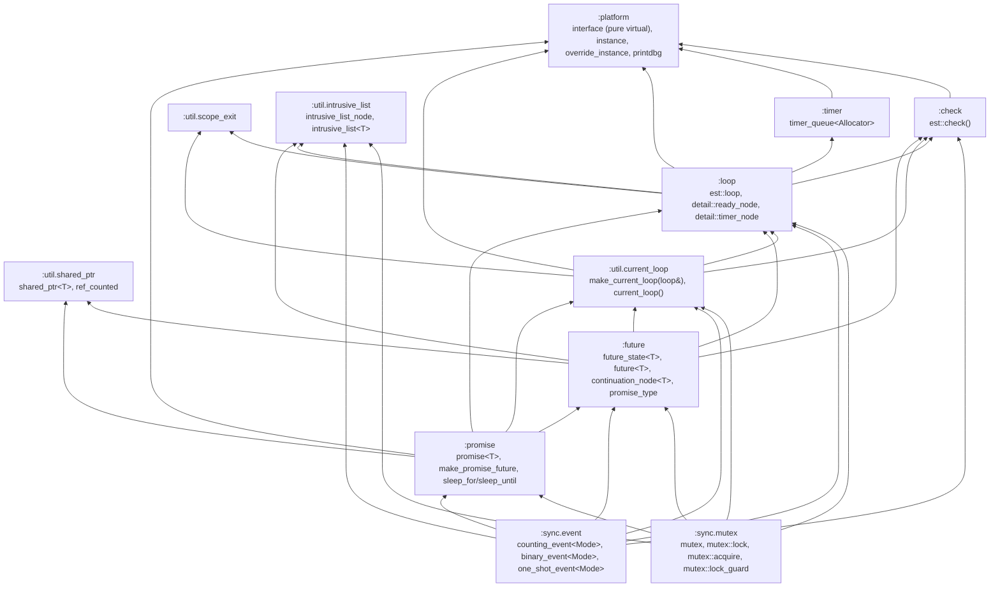
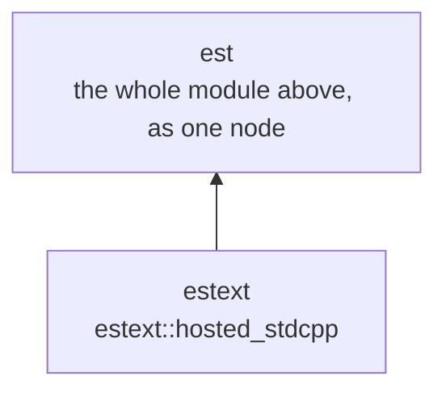

# Architecture

## Module layout and dependency direction

`est` is one C++23 module (`est`) split into partitions, one per source file.
`est/src/est.cppm` is the umbrella that `export import`s every partition, so
consumer code just does `import est;`. The partitions form a strict DAG —
each only imports the partitions below it:

The one non-obvious edge is **`:loop` sits *below* `:future`/`:promise`, not
above them** — even though a loop's whole job is running futures'
continuations. See "Why `:loop` doesn't depend on `:future`" below; it's the
key to understanding how the continuation mechanism is split across files.
`:sync.mutex` depends on `:loop` too ([Coroutines](Coroutines.md)) — an
awaitable `lock()` needs somewhere to defer a waiter's resumption to, and
`est::loop::enqueue_ready()` is that somewhere; `:loop` still knows nothing
about `:sync.mutex` in return. `:sync.mutex` also depends on `:future`/
`:promise` for `acquire() -> future<lock_guard>`
— an alternative to `lock()`/`unlock()` returning a move-only RAII handle
instead of requiring `co_await`, built directly on `est::promise<lock_guard>`
rather than a coroutine of its own, the same "producer without co_await"
pattern `sleep_until()` (`:promise`) already uses.

`:sync.event` (`counting_event<Mode>`, `binary_event<Mode>`,
`one_shot_event<Mode>` - an awaitable counting semaphore and the
auto-reset/manual-reset event types built on top of it) depends on the same
partitions `:sync.mutex` does, for the same reasons - it reuses
`:sync.mutex`'s own `loop&`/`intrusive_list<detail::ready_node>`/resume-node
pattern outright rather than introducing a new one (see
["`est::counting_event<Mode>` reuses this pattern
unchanged"](Coroutines.md#estcounting_eventmode-reuses-this-pattern-unchanged)).
It additionally depends on `:check` directly, unlike `:sync.mutex`, for
`set(n)`'s `n > 0` precondition and `one_shot_event::set()`'s at-most-once
enforcement.

`:util.current_loop` is the other partition worth calling out - the
free functions `est::make_current_loop(loop&)`/`est::current_loop()`
behind the "current loop" mechanism every loop-consuming function in this
codebase (`make_promise_future()`, `sleep_for()`, `est::mutex`,
`est::counting_event<Mode>`, a coroutine's own `promise_type`) resolves,
unconditionally - none of them take or cache an explicit `loop&` of their
own any more ([The Loop and Timers](Loop-And-Timers.md)). Deliberately
free functions in their own partition, not methods on `est::loop` itself:
a primitive ready-queue-and-timers type and this registration mechanism
are two separate concerns. Nothing unusual about where this partition
sits, unlike `estext` below: it's an ordinary partition of `est` itself,
free to `import :loop` directly (only `:platform`, and anything that must
stay *below* `:loop`, can't).

## `estext`: a second, separate module for concrete backends

`hosted_stdcpp` (`est::check()`/`est::loop`'s one concrete
`platform::interface` implementation - `std::chrono` for the clock,
`std::this_thread` for sleeping, `std::cerr` for diagnostics) does *not*
live inside `est` at all - not as one of the partitions above, not even
one re-exported for convenience. It's the sole content of a genuinely
separate module, `estext` (`estext/src/hosted_stdcpp.cppm`, its own CMake
target linked `PUBLIC` against `est::est`):

This is an explicit design goal, not an accident of
where the file happened to land: `import est;` alone gives a consumer the
complete framework with *zero* trace of any concrete backend - no
partition silently re-exporting `hosted_stdcpp`, nothing `std::chrono`/
`std::cerr`-shaped for a linker to even consider pulling in. A consumer
that wants a working, ready-to-use backend opts in with a second,
separate import: `import est; import estext;`. A future bare-metal
backend would be its own similarly separate module, never touching
`estext` - `est` itself stays the one thing every backend module depends
on, never the reverse.

`hosted_stdcpp` needing to name `est::loop` (its own "current loop"
fallback, [The Loop and Timers](Loop-And-Timers.md)) is exactly why it
can't be one of `est`'s own partitions in the first place: `:platform`
sits below `:loop` in `est`'s *internal* DAG above specifically so it
never has to import `:loop`, and a partition of `est` is bound by that
same internal DAG. `estext` isn't a partition of `est` at all - it's a
wholly separate module that simply `import est;`s the finished product,
so it sees the complete, already-defined `est::loop` with no special
access needed (unlike `:platform` itself, which forward-declares
`est::loop` - `export namespace est { class loop; }`, `platform.cppm`'s
own top comment on why an *exported* forward declaration in one partition
attaches to the real definition in another partition of the *same*
module - purely so
`get_current_loop_context()`/`set_current_loop_context()` can return/take
a genuinely typed `est::loop*` instead of an opaque `void*`, without
`:platform` ever importing `:loop`).

Making `hosted_stdcpp` one of `est`'s own partitions instead - even
though "only `:platform` can't import `:loop`, but a different partition
of the same module can" - would still leave `hosted_stdcpp` inside
`est`'s own module boundary, always compiled and logically exported as
part of it. A genuinely separate module makes the boundary real rather
than incidental.

`import est;` also does *not* install a default `platform::interface` as
a side effect - that decision belongs to the
program's own entry point, not to the library. `examples/hello_world/
main.cpp` and `examples/sleep_sort/main.cpp` each `import estext;`,
construct a `hosted_stdcpp`, and `platform::override_instance()` it at
the top of their own `main()`; `est/tests/`'s own Catch2 binary does the
same once, in a small custom `main()` (`est/tests/test_main.cpp`, linked
against `Catch2::Catch2` rather than `Catch2::Catch2WithMain`), instead of
every individual test file.

## Design philosophy

- **Single-threaded, no atomics, no OS-level concurrency protection — yet.**
  `est::shared_ptr`'s ref count is a plain `int`, and `est::loop` is driven
  from exactly one call stack. This isn't an oversight to fix later; it's a
  deliberate scope boundary — real interrupt-context protection gets added
  when a backend that actually needs it exists (bare-metal interrupts, or a
  future multi-loop), not speculatively. `est::mutex::lock()` *is* real
  protection against a different, still-single-threaded hazard though
  ([Coroutines](Coroutines.md)): two coroutines interleaving at a
  `co_await` while both hold a reference to the same structure.
- **Allocator-first.** Every owned object — `shared_ptr<T>`'s control block,
  a continuation node, `timer_queue`'s storage, `loop`'s own containers — is
  built through a `std::pmr::polymorphic_allocator<std::byte>`, threaded in
  explicitly rather than defaulting to global `new`/`delete`. See
  [Allocation Patterns](Allocation-Patterns.md) for what that buys a caller
  in practice.
- **`est::platform` is the one runtime-polymorphic seam.** Everything that
  differs between a hosted-Linux program and a hypothetical future bare-metal
  target — the monotonic clock (`now()`), how to wait for a deadline
  (`sleep_until()`), what happens when a precondition check fails
  (`assert_failure()`) — goes through `est::platform::interface`, a virtual
  base swapped via a single global pointer (`instance()`/
  `override_instance()`). Everything else in the framework is templates and
  concrete classes; this is the only place virtual dispatch is used for
  polymorphism rather than for type erasure.
- **`est::check()`, not `assert()`.** A plain function (named to avoid
  colliding with the `<cassert>` macro even fully-qualified), compiled away
  entirely under `NDEBUG`. Every
  precondition it guards is explicitly documented as "debug-checked,
  undefined behavior on release-build violation" — the codebase's consistent
  stance rather than something reinvented per call site.
- **Explicit dependencies over global state, except where global state is
  the whole point.** `est::platform::instance()` is a deliberate global (a
  stateless vtable swap, safe to share). `est::loop` is deliberately *not* a
  global (see [The Loop and Timers](Loop-And-Timers.md)) — it carries real
  mutable state that a shared global would let leak between unrelated call
  sites (or tests). This asymmetry is intentional, not inconsistent: the
  test is "does this object have state a second, unrelated use of it could
  see or corrupt."

## Why `:loop` doesn't depend on `:future`

`est::loop`'s ready-queue needs to hold something type-erased — logically,
"a future's queued continuation." The natural design would have `loop`
import `:future` and hold `est::detail::continuation_node<T>*` (type-erased
down to just `T`, or further). But `future_state<T>` *also* needs to depend
on `loop` — every `then()` call hands its continuation to
`loop.enqueue_ready()` instead of running it inline. Two partitions can't
import each other in C++20 modules (or in any sane build), so one direction
has to give.

The fix: `:loop` defines its *own* minimal type-erased bases —
`est::detail::ready_node` (a `run()` + `destroy(allocator, ran)` pair, the
ready-queue's element type) and `est::detail::timer_node` (`fire()` +
`destroy(allocator, ran)`, the pending-timer list's element type) — and
knows nothing about futures, promises, or continuations at all.
`:future`'s `continuation_node<T>` then *inherits* `ready_node` (adding the
one T-dependent thing it needs, `invoke(future_state<T>&)`), and
`:promise`'s `sleep_for()`/`sleep_until()` build a `sleep_resume_node`
directly on top of `timer_node` (no generic callback-wrapping layer - it
holds the `promise<void>` itself) to bridge a fired timer into a
`future<void>`. Dependency direction stays a clean DAG: `:loop` → `:future`
→ `:promise`.

This is also *why* `est::loop`'s ready-queue, `est::future_state<T>`'s
"not yet ready" queue, and `est::mutex`'s own waiter list all share one
root node type and one list container - `est::intrusive_list_node` and
`est::intrusive_list<T>` (`est:util.intrusive_list`), a genuinely generic
utility rather than something specific to any one of its users. `ready_node :
public intrusive_list_node` directly, and `est::mutex`'s own waiter
queue is typed `intrusive_list<detail::ready_node>` too - the same
type `est::loop`'s ready-queue and `est::future_state<T>`'s continuation
queue already use, not just a sibling built on the same base - so the same
enqueue/dequeue mechanics serve all three, with none of them depending on
either of the others. See [Continuation Node Mechanism](Continuation-Node-Mechanism.md)
for the full type hierarchy this produces, and [Coroutines](Coroutines.md)
for how `est::mutex`'s waiters became `ready_node`s in the first place.

## The producer/consumer split: `promise<T>` / `future<T>` / `future_state<T>`

`est::future_state<T>` is the one owned object behind a promise/future pair —
the value-or-exception storage plus the continuation queue. It is
**deliberately not exported** from the module: a caller only ever sees it
through the thin, `shared_ptr`-backed `est::promise<T>` (producer) and
`est::future<T>` (consumer) handles that wrap it, including inside a
"wrapped" `then()` callback (which gets a real `future<T>`, built on demand
via `shared_from_this()` — `future_state<T>` inherits `est::ref_counted`
(`est:util.shared_ptr`) for exactly this — never the `future_state<T>`
itself). `future<T>::clone()` is the other way to get a second handle: an
explicit caller-requested alias of the same `future_state<T>`, rather
than one `then()` builds internally for its own use. This
mirrors `std::promise`/`std::future`'s own split, but goes one step further
by making the shared state module-private — there's no way for calling code
to name `future_state<T>` even by accident.

`make_promise_future<T>()` (`est:promise`) is the *only* way a
`future_state<T>` gets created; `promise<T>`/`future<T>` otherwise only exist
as the result of a move. See [Allocation Patterns](Allocation-Patterns.md)
for exactly what that single call allocates.
