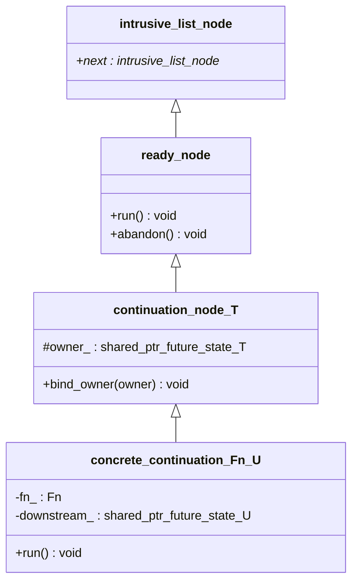

# The continuation node mechanism

This page is a deep dive into how `future<T>::then(fn)` actually gets `fn`
run — the type hierarchy behind it, how a node moves from "registered" to
"run and destroyed," and why the design looks the way it does.

## The type hierarchy

Three layers, each adding exactly what the layer above needs and nothing
more, split across two module partitions:



- `intrusive_list_node` (real name `est::intrusive_list_node`) lives in
  `est:util.intrusive_list` — a genuinely generic utility shared by
  `est::counting_event<Mode>` (which `est::mutex` now builds `lock()` on
  top of directly, rather than keeping a waiter list of its own - issue
  #67), `est::future_state<T>`, and `est::loop` alike (see
  [Architecture](Architecture.md)).
- `ready_node` (real name `est::detail::ready_node`) lives in `est:loop`.
- `continuation_node_T` (real name `est::detail::continuation_node<T>`)
  lives in `est:future`.
- `concrete_continuation_Fn_U` (real name `concrete_continuation<Fn, U>`) is
  a private nested class template *inside* `future_state<T>`, also in
  `est:future`.

(Class names above are simplified to plain identifiers — angle brackets and
namespaces don't render reliably in Mermaid class diagrams — see the code
excerpts below for the real, fully-qualified signatures.)

- **`intrusive_list_node`** (`est:util.intrusive_list`) is nothing but an
  intrusive `next` pointer. It's the root of *three* independent intrusive
  lists in this codebase: `est::counting_event<Mode>`'s own waiter list
  (`est::mutex`'s `lock()` is built directly on top of it, not a separate
  waiter list of its own), and (via
  `ready_node`) both `future_state<T>`'s
  "not yet ready" queue and `est::loop`'s "ready to run" queue. Reusing one
  link field across all of them is safe because a node is only ever a
  member of one such list at a time — see "Node lifecycle" below. The
  accompanying `est::intrusive_list<T>` container (templated so
  `dequeue()` hands back `T*` directly, no cast needed at the call site)
  is what each of the three actually stores its nodes in - see
  [Allocation Patterns](Allocation-Patterns.md) and
  [Architecture](Architecture.md) for more on why this lives in a shared
  util partition instead of inside `est:sync.event`.
- **`ready_node`** (`est:loop`) is the type-erased base the loop's
  ready-queue actually holds. It adds `run()` (invoke whatever this is,
  however it does that), a virtual destructor, and `abandon()` (a hook
  called on a node that never ran, right before it's deleted — see "Node
  lifecycle" below). Deallocation itself is a plain `delete` through this
  base: every concrete node type has its own `operator new`/`operator
  delete` (inherited from `detail::current_allocator_new_delete<T>`,
  `est:util.current_loop` — see that class's own doc comment for why it
  can't instead live on `ready_node` itself), which is what makes that
  safe and correctly sized — see [Allocation Patterns](Allocation-Patterns.md)
  for the full mechanism. `:loop` knows nothing more about what a
  `ready_node` actually *is* — that's the whole point (see
  [Architecture](Architecture.md#why-loop-doesnt-depend-on-future)).
- **`continuation_node<T>`** (`est:future`) is the first T-dependent layer,
  and a thin one: it adds only `owner_` (a `shared_ptr<future_state<T>>`,
  `protected`) and `bind_owner()` to set it — the mechanism that keeps a
  queued node's `future_state<T>` alive; see "The `bind_owner()` subtlety"
  below. It does *not* implement `run()` — that's each concrete node's own
  job now (see the note below on why).
- **`concrete_continuation<Fn, U>`** is a private nested class template
  *inside* `future_state<T>` — one instantiation per distinct
  `(T, Fn, U)` triple a real `.then()` call site produces. It's the layer
  that finally knows the actual callback (`fn_`) and where its result goes
  (`downstream_`, a `shared_ptr<future_state<U>>`). `run()` is implemented
  here, reading `owner_` directly from `continuation_node<T>`.

An earlier version of this hierarchy had `continuation_node<T>` implement
`run()` once, for every `T`, as `invoke(*owner_)`, with each concrete node
instead overriding a second, separately virtual `invoke(future_state<T>&)`.
That bought nothing: the only thing `invoke()` was ever called with was
`*owner_`, so `state` was always just `owner_` read back through a
parameter. It did cost something, though — a second, non-devirtualizable
virtual call (`est::loop`'s ready-queue only ever holds a `ready_node&`, so
`run()`'s own dispatch can't statically know which `invoke()` override it's
about to make a *second* indirect call to) on every single continuation
this framework ever runs. `bind_owner()`/`owner_` stay shared at the
`continuation_node<T>` level regardless — sharing them costs nothing, since
they're a plain data member and a non-virtual setter, not something a
second vtable slot was ever paying for — but `run()` itself now belongs to
each concrete node, which reads `owner_` directly instead of through a
parameter. (Issue #63; see `docs/PLAN.md` for the full writeup.)

## What `then()` actually builds

```cpp
template <detail::then_callback_for<T> Fn> auto then(Fn&& fn) {
  using decayed_fn = std::decay_t<Fn>;
  using downstream_value_type = detail::unwrap_future_t<raw_result_t<decayed_fn>>;
  auto allocator = current_allocator();
  auto downstream = shared_ptr<future_state<downstream_value_type>>::make(allocator);
  auto downstream_for_node = downstream; // copy: the node keeps its own reference too
  using node_type = concrete_continuation<decayed_fn, downstream_value_type>;
  auto* node = new node_type(std::forward<Fn>(fn), std::move(downstream_for_node));
  set_continuation(*node);
  return future<downstream_value_type>(std::move(downstream));
}
```

Only `current_allocator()` is needed to build the downstream state and
its node - `current_loop()` itself is never resolved here;
`set_continuation()` resolves it fresh on its own, only if this
`future_state` already turns out to be ready. (This is `then()`'s own
shape specifically - `then_fast()`, its sibling, shares every step above
through one private `then_impl()`; see "`then_fast()`: running inline
instead of deferring" below for the one thing that differs between the
two.)

Four things happen, in order:
1. A **new `future_state<U>`** is created (`U` = `downstream_value_type`,
   already resolved through monadic flattening if `Fn` returns a `future<V>`
   — see "Flattening is not a special case" below). This is the state
   behind the `future<U>` `then()` will return to the caller.
2. A **`concrete_continuation<Fn, U>` node** is allocated directly (not
   through `shared_ptr` — see [Allocation Patterns](Allocation-Patterns.md)
   for why), holding `fn` and a `shared_ptr` copy of the new downstream.
3. **`set_continuation(*node)`** registers the node with `this` (the
   *parent* `future_state<T>`, the one `then()` was called on).
4. The caller gets back a `future<U>` wrapping the new downstream — *not*
   the node. The node is now owned entirely by whichever queue it's sitting
   in (see "Node lifecycle").

## Node lifecycle

```mermaid
sequenceDiagram
  participant caller
  participant parent as parent future_state&lt;T&gt;
  participant node as continuation_node&lt;T&gt;
  participant est_loop as est::loop

  caller->>parent: then(fn)
  parent->>node: allocate (holds fn, downstream)
  parent->>parent: set_continuation(node)
  alt not ready yet
    parent->>parent: waiters_.enqueue(node)
    Note over parent,node: node is owned by raw pointer only -<br/>owner_ is still null
    caller->>parent: (later) set_value()/set_exception()
    parent->>parent: complete(): waiters_.dequeue()
  end
  parent->>node: bind_owner(shared_from_this())
  parent->>est_loop: enqueue_ready(node)
  Note over node: node now holds a real shared_ptr<br/>keeping `parent` alive
  est_loop->>est_loop: drain_ready(): ready_.dequeue()
  est_loop->>node: run()
  node->>node: reads *owner_, runs fn_, reports into downstream_
  est_loop->>node: delete [always, via scope_exit guard]
```

Two possible starting states, one converging path:

- **Parent not ready yet.** `set_continuation()` enqueues the node into the
  parent `future_state<T>`'s own `waiters_` list. At this point the node is
  owned *by pointer* by the parent — not by `shared_ptr`. Later, when
  `set_value()`/`set_exception()` runs, `complete()` drains `waiters_` and,
  for each node, calls `bind_owner()` before handing it to
  `loop.enqueue_ready()`.
- **Parent already ready.** `set_continuation()`'s `if (ready())` branch
  takes the same `bind_owner()` step immediately, skipping `waiters_`
  entirely - then either `enqueue_ready()`s the node (the default) or, if
  the caller opted in via `then_fast()`, runs it right here instead - see
  "`then_fast()`: running inline instead of deferring" below.

`waiters_`'s own declared element type is actually `detail::ready_node`
(`est:loop`), not `continuation_node<T>` as the diagram above simplifies
it to - deliberately: `future_state<T>` now inherits `est::ref_counted`
(`est:util.shared_ptr`), so `shared_ptr<future_state<T>>` allocates it
directly rather than through a separate control block, and that in turn
means naming `shared_ptr<future_state<T>>` anywhere requires
`future_state<T>` to already be a complete type. Keying `waiters_` on
`continuation_node<T>` specifically would force exactly that - complete
- while `future_state<T>` is still being defined (its own `waiters_`
member declaration is what would be doing the forcing), a genuine
circular dependency between the two class templates. `ready_node` is
already complete at that point regardless of `T`, so `complete()`
recovers the real `continuation_node<T>&` with a `static_cast` where it
actually needs it (`bind_owner()`) - safe by construction, since
`set_continuation()` is the only thing that ever enqueues anything here,
always a real `continuation_node&`. `future_state<T>`'s own destructor
needs no such downcast: `abandon()`/`delete` both work through the plain
`ready_node&` it already has. See `continuation_node<T>`'s own doc
comment (`future.cppm`) for the full account.

Either way, once a node reaches the loop's ready-queue it's in exactly the
same state: owned by the queue (an intrusive link, no `shared_ptr`) *and*
holding its own `shared_ptr<future_state<T>>` back to its parent. The loop's
`drain_ready()` eventually dequeues it, `run_one()` calls `node.run()`
(one virtual dispatch, straight into the concrete node's own `run()`,
reading `owner_` directly — see the note in "The type hierarchy" above),
and — always, via a `scope_exit`-based guard, whether or not `run()`
somehow threw — `delete` deallocates it, through this concrete node
type's own `operator delete` (see
[Allocation Patterns](Allocation-Patterns.md) for why every concrete node
type needs its own).

### The `bind_owner()` subtlety

`continuation_node<T>` takes its `shared_ptr<future_state<T>>`
owner via a separate `bind_owner()` call, not at construction time.
Taking it at construction would create a reference cycle:

A node still sitting in the parent's own `waiters_` (not yet ready) is
already reachable *from* that same parent, by raw pointer. If it *also* held
a permanent `shared_ptr` back to that parent from the moment it was
constructed, the parent would be counting itself as one of its own owners —
a genuine reference cycle. A `future_state<T>` whose promise and future were
both dropped without ever completing would then never reach a zero ref
count (the node it still owns keeps it artificially alive), so it — and the
node — would leak forever instead of being cleaned up by
`future_state<T>`'s own destructor the normal way.

`bind_owner()` avoids that: called exactly once, right at the moment a node
transitions from "pending, exclusively owned by the parent" to "queued on
the loop, needs to survive independently of the parent's own ref count."
Before that point, no cycle exists (the node has no strong reference to its
parent). After that point, the node is no longer reachable *from* the
parent's own bookkeeping (`waiters_` has already given it up), so the
`shared_ptr` it now holds is a genuine, cycle-free keep-alive — exactly what
prevents the parent `future_state<T>` from being destroyed out from under a
continuation still sitting in the loop's ready-queue, even if every other
`promise`/`future` handle for it has already been dropped.

## The two calling conventions

`run()`'s real body — the part `concrete_continuation<Fn, U>` actually
implements — reads `owner_` (`continuation_node<T>`'s own member) and then
dispatches on how `Fn` can be called, checked in this order:

```cpp
void run() final {
  auto& state = *this->owner_;
  try {
    if constexpr (detail::invocable_unwrapped<Fn, T>()) {
      if (state.failed()) {                        // "unwrapped", auto-propagate
        downstream_->set_exception(state.get_exception());
      } else if constexpr (std::is_void_v<T>) {
        invoke_and_fulfill();                        // "unwrapped", T = void
      } else if constexpr (std::invocable<Fn&, T&&>) {
        if (this->owner_.count() == 1) {
          invoke_and_fulfill(std::move(state).get()); // "unwrapped", sole owner: move
        } else {
          invoke_and_fulfill(state.get());            // "unwrapped", shared: copy/reference
        }
      } else {
        invoke_and_fulfill(state.get());              // "unwrapped", Fn can't take T&&
      }
    } else {
      future<T> view(state.shared_from_this());   // "wrapped"
      invoke_and_fulfill(view);
    }
  } catch (...) {
    downstream_->set_exception(std::current_exception());
  }
}
```

- **Unwrapped** (`Fn` invocable with `const T&`, or with nothing when
  `T = void`): called *only* on success, with the value itself. On failure,
  `Fn` is skipped entirely and the exception is forwarded straight into
  `downstream_` via `get_exception()` — a plain pointer copy, not a
  throw/catch round-trip, since `failed()` already established there's an
  exception waiting. When `Fn` also accepts `T&&` (by value, by `const T&`,
  or by `T&&`/`auto&&` itself — excludes a purely lvalue-bound callback like
  `[](auto& value)`) and this node is the sole `shared_ptr<future_state<T>>`
  owner (`owner_.count() == 1` — no sibling continuation, no live
  `future`/`promise` handle left), `run()` moves the stored value out
  instead of reading a reference into it (issue #64). `future<T>::then(Fn&&)
  &&` exists to make that count come back 1 more often, by dropping the
  caller's own reference before delegating to `future_state<T>::then()`
  (issue #71) — see `future.cppm`.
- **Wrapped** (`Fn` invocable with `future<T>&`): always called, success or
  failure, with a *fresh* `future<T>` view built via `shared_from_this()` —
  never a stored one, since a continuation only ever runs once. `Fn`
  inspects `ready()`/`failed()`/`get()` itself to decide what to do. No
  implicit unwrap, no auto-propagation.

Checked in that order — unwrapped first — so a generic callback (e.g. an
`auto&` lambda, incidentally invocable both ways, since a template
parameter binds to either) defaults to unwrapped. Wrapped is only chosen
when unwrapped genuinely isn't viable: `Fn` explicitly typed to take
`future<T>&` isn't invocable with a plain `const T&`, so it still falls
through to wrapped.

(`invoke_and_fulfill()`/`fulfill()`, called from both branches above, are
`concrete_continuation<Fn, U>`'s own private helpers — see "Flattening is
not a special case" below for `fulfill()`.)

`then_callback_for<Fn, T>` (the concept constraining `then()`'s template
parameter) checks in the identical order, and for a sharper reason than
just matching `run()`'s own precedence:

```cpp
template <class Fn, class T>
concept then_callback_for = invocable_unwrapped<Fn, T>() || std::invocable<Fn&, future<T>&>;
```

Constraint disjunction (`||`) short-circuits left-to-right — whichever
operand is written first is the one actually evaluated for an `Fn` that
satisfies it, the second never even instantiated. That matters here
because the two checks aren't equally safe to attempt: a generic callback
that's only *valid* when called with a plain `T` — one that returns a copy
of its argument, say, which `future<T>`'s deleted copy constructor makes
ill-formed for a `future<T>&` argument — doesn't fail `std::invocable<Fn&,
future<T>&>` gracefully. "Use of a deleted function" isn't an
overload-resolution failure the way "no viable candidate" is, so it isn't
SFINAE-friendly; instantiating that check at all is a hard compile error,
constraint or no constraint. Checking `invocable_unwrapped<Fn, T>()`
first means an `Fn` for which it's satisfied never triggers the wrapped
check at all — the same short-circuiting that decides `run()`'s own
dispatch order is what makes this ordering *necessary* here, not just
consistent. An `Fn` matching neither shape still fails right at the
`then()` call site with a "constraints not satisfied" diagnostic, not
deep inside `run()`'s own
instantiation.

## `then_fast()`: running inline instead of deferring

Issue #65: `co_await` on an already-ready `future<T>` resumes inline
(`future_awaiter<T>::await_ready()`, [Coroutines](Coroutines.md)), but
`then()` registered on an already-ready `future_state<T>` always deferred
through `est::loop`'s ready-queue regardless - a "subtly different"
asymmetry between the two ways of consuming a future. `then_fast()` is
the opt-in fix: an identical sibling of `then()` (same wrapped/unwrapped
dispatch, same monadic flatten, same move optimization above) except a
continuation registered on an already-ready `future_state<T>` runs
immediately instead of deferring:

```cpp
void set_continuation(continuation_node& node, bool run_inline_if_ready = false) {
  if (ready()) {
    node.bind_owner(this->shared_from_this());
    if (run_inline_if_ready) {
      const std::unique_ptr<continuation_node> owned(&node);
      owned->run();
      return;
    }
    current_loop().enqueue_ready(node);
    return;
  }
  waiters_.enqueue(node);
}
```

`then()`/`then_fast()` share one private `then_impl(fn, run_inline_if_ready)`
- identical in every way (node allocation, downstream `future_state`,
registration) except which value they pass through to
`set_continuation()` above. `run_inline_if_ready = true` reuses the exact
"run, then delete" idiom `est::loop`'s own `run_one()` uses on its own
drain pass ([Loop and Timers](Loop-And-Timers.md)) - just performed
directly here (via a local `unique_ptr`, not a bare `delete` - a virtual
destructor makes deleting through this base reference safe either way,
see `ready_node`'s own doc comment, `est:loop`), since `run_one()` itself
is private to `est::loop`.

**Why an opt-in method, not `then()`'s own new default.** `then()` must
stay safe for a chain of any length: deferring every completion through
`est::loop` turns unbounded chain length into an iterative drain instead
of direct recursion on the call stack (`set_continuation()`'s own doc
comment, `future.cppm`) - the same "never invoke a continuation
synchronously from within another's own call stack" invariant this
codebase applies everywhere else (`mutex::unlock()`,
`counting_event<Mode>::set()`, ...). `then_fast()` is for a caller that
specifically knows `fn` is cheap and wants the already-signaled case
(say, `counting_event<Mode>::wait()`'s own already-signaled fast path,
[Coroutines](Coroutines.md)) to resolve without an extra loop round trip,
accepting the same recursion-depth responsibility a coroutine's
already-ready `co_await` always had.

`run_inline_if_ready` only ever matters on the already-ready branch: a
`then_fast()` call registered on a *not-yet-ready* `future_state<T>` just
enqueues into `waiters_`, identically to `then()` - there's nothing to
run inline yet, and no flag is stored on the node for `complete()` to
consult later. Whether a given `then_fast()` call actually runs inline
or not is decided once, at registration time, by whether the future was
already ready then - not by anything remembered afterward.

**The flatten case is deliberately excluded.** A `then_fast()` callback
that itself returns a `future<V>` still flattens through the ordinary,
always-deferred `fulfill()`/`flatten_forwarder<V>` path below - "fast"
doesn't thread through monadic flattening. This keeps the addition to a
single call site's behavior (the direct registration in `then_impl()`)
rather than a second property every future-returning path in this class
has to carry.

**A real cost: `then_fast()`'s own `&&` overload can't get the move
optimization above.** `concrete_continuation<Fn, U>::run()`'s
`owner_.count() == 1` check only ever reaches 1 for `then()` because
`run()` happens *later*, once `est::loop` drains it - by which point
whatever temporaries were on the registering call's own stack (including
`future<T>::then(Fn&&) &&`'s own `state` local) have already unwound.
`then_fast()`'s `run()` happens synchronously, inside that same call -
its `state` local is still alive, holding a reference, at the exact
moment `run()` checks `owner_.count()`. That reference plus `owner_`
itself already puts the count at 2, never 1, no matter how carefully a
caller manages every other handle. `future<T>::then_fast(Fn&&) &&` still
exists, for API-shape symmetry with `then()` and because releasing a
handle early is never harmful - it just isn't what makes the difference
here the way it does for `then()`.

## Flattening is not a special case

When `Fn`'s result is itself a `future<V>`, `then()` doesn't special-case
the node hierarchy at all — `fulfill()`'s `is_future_v` branch registers a
small forwarding node directly on the inner future's own `future_state<U>`,
which reports that inner future's eventual value or exception straight into
the outer `downstream_`:

```cpp
template <class R> void fulfill(R&& result) {
  if constexpr (detail::is_future_v<std::decay_t<R>>) {
    auto* node = new detail::flatten_forwarder<U>(downstream_);
    result.state_->set_continuation(*node);
  } else {
    downstream_->set_value(std::forward<R>(result));
  }
}
```

`result.state_` — `future<U>`'s private `shared_ptr<future_state<U>>`
member — is reached directly, not through any public `future<U>` method:
`future<T>` grants every `future_state<X>` instantiation friendship
(`template <class> friend class future_state;`) precisely so this one call
site, itself nested inside a `future_state<T>` instantiation, can register a
continuation on an *inner* future's state without `future<U>` needing to
expose a method for it at all.

This deliberately doesn't go through `.then()`: `then()` exists to hand
the *caller* a `future<U>` to chain onward from, but this call site has
nowhere to put one — the forwarding logic already reports straight into
the real `downstream_`. Registering via `.then()` anyway would mean
paying for a throwaway `future_state<void>` plus a full
`concrete_continuation<Fn, void>` — with its own wrapped/unwrapped dispatch
and `fulfill()`/`invoke_and_fulfill()` machinery none of it ever needed —
for every single flattening `.then()` call, allocated and freed without
anything ever observing either one. `detail::flatten_forwarder<T>` avoids
all of that: a free class template in `est::detail`, alongside
`continuation_node<T>`, not nested inside `future_state<T>` at all,
registered directly via `set_continuation()`:

```cpp
template <class T>
class flatten_forwarder final : public continuation_node<T>,
                                 public current_allocator_new_delete<flatten_forwarder<T>> {
public:
  explicit flatten_forwarder(shared_ptr<future_state<T>> downstream)
      : downstream_(std::move(downstream)) {}

  void run() final {
    auto& state = *this->owner_;
    if (state.failed()) {
      downstream_->set_exception(state.get_exception());
      return;
    }
    try {
      if constexpr (std::is_void_v<T>) {
        downstream_->set_value();
      } else {
        downstream_->set_value(std::move(state).get());
      }
    } catch (...) {
      downstream_->set_exception(std::current_exception());
    }
  }

  void abandon() noexcept override {
    downstream_->set_exception(std::make_exception_ptr(abandoned_exception()));
  }

private:
  shared_ptr<future_state<T>> downstream_;
};
```

`abandon()` completing `downstream_` with `detail::abandoned_exception`
(`est:loop` - the one shared, message-less exception type every
`abandon()` override in this codebase that needs to actually complete
something throws, rather than one hand-rolled `std::runtime_error`
literal per call site) - rather than leaving it dropped, `ready_node::
abandon()`'s own default no-op body - matters for the same reason
`future_resume_node<T>`'s own doc comment (above) gives: a coroutine
`co_await`-ing the outer `future<T>` this node forwards into holds
`downstream_`'s own `future_state` alive across its own suspension, so
dropping just this node's reference to it without completing it would
strand that coroutine's frame with nothing left to free it. (Originally
left unhandled - "not a settled answer" - until `est::mutex::lock()`'s
own `.then()`-based slow path, `est/src/sync/mutex.cppm`, turned the gap
from theoretical into a real, test-caught leak; see `docs/PLAN.md`'s
"Issue #66 & #67" entry.)

The forwarding logic this node needs is fixed — it never varies by
closure, only by `T` — so `flatten_forwarder<T>` bakes that one shape in
directly: no `Fn` member, no lambda, no `future<T>` view built via
`shared_from_this()` (it operates on `*owner_`, which already exposes
`failed()`/`get_exception()`/`get()` publicly). Every flattening `.then()`
at the same inner value type `T` reuses the *same* `flatten_forwarder<T>`
instantiation, instead of minting a fresh node type per `(T, Fn, U)` call
site — fewer template instantiations overall for a codebase with many
distinct flattening call sites sharing the same inner future type.
`concrete_continuation<Fn, U>` overrides `abandon()` the identical way,
completing its own `downstream_` with the same `detail::abandoned_exception`
instead of leaving it dropped - the same "Issue #66 & #67" fix covers
both classes at once, since both carry the identical hazard.

`run()` moves the inner value out — `std::move(state).get()`, not a
copying `.get()` — since `state` is a fresh, single-owner future_state
(`fn`'s own return value, not a stored one). That move matters beyond
speed: a `future<std::unique_ptr<T>>` returned from a `then()` callback
couldn't be flattened through a copying path at all, since
`std::unique_ptr` has no copy constructor to select.

[Allocation Patterns](Allocation-Patterns.md#flattening-costs-one-extra-allocation)
has the same story from that page's own angle (total allocation counts per
`then()` shape).

## `est::when_all()`: forcing wrapped mode, and surviving abandonment

`est::when_all(future<Ts>&... futures) -> future<void>` (`est/src/when_all.cppm`,
issue #54) resolves once every one of `futures` is *accounted for* -
completed or abandoned, succeeded or failed - each input stays owned by
the caller (`when_all()` only ever registers `then_fast()` continuations
on it, never moves or consumes it), which inspects `failed()`/`get()` on
whichever of them it cares about afterward. Internally, it's a small
counting barrier: a shared `detail::when_all_state{one_shot_event<manual>
event; int remaining;}`, and one tracking chain per input
(`detail::when_all_track<T>()`) that decrements `remaining` and calls
`event.set()` the moment it reaches zero. `event.wait()` (`:sync.event`)
is what produces the `future<void>` `when_all()` hands back to its own
caller - Mode = manual matches the "one broadcast, however many observers"
shape this state has, whether that's the caller's own further `.then()`s
or a `clone()`d handle to the same returned future.

That tracking chain has two independent correctness traps, both found
the same way - a test written specifically to exercise the failure mode,
not by inspection - and both fixed in the shape `when_all_track<T>()`
ended up with:

**Trap one: a generic hook silently skips failed inputs.** The obvious
shape for "run this the same way regardless of `T`" is a generic `[](auto&
v) {...}` lambda. `then_callback_for<T>`'s own dispatch
(`invocable_unwrapped<Fn, T>()`, above) checks unwrapped mode first -
`std::invocable<Fn&, const T&>` - and a generic lambda satisfies that
check too, since a template parameter binds to `const T&` just as
readily as to `future<T>&`. Landing in unwrapped mode is exactly wrong
here: unwrapped mode auto-propagates a failure straight to the
`then_fast()`-returned future *without ever calling `fn`* (see "The two
calling conventions" above) - so a generic hook would silently never
decrement `remaining` for a failed input, hanging `when_all()`'s
returned future forever the first time any one constituent failed. The
fix: type the hook explicitly on `future<T>&`, never a generic parameter.
A `future<T>&` parameter cannot bind a `const T&` argument - they're
unrelated types - so `invocable_unwrapped<Fn, T>()` is false regardless
of `T` (including `T = void`, where the zero-argument unwrapped check
fails for the identical reason: such a hook always takes exactly one
argument), forcing wrapped mode - `std::invocable<Fn&, future<T>&>`,
which runs unconditionally, success or failure.

**Trap two: a correctly-typed hook still skips *abandoned* inputs.**
Even once forced into wrapped mode, a hook registered *directly* on
`input` is never invoked if `input`'s own `future_state` is *abandoned*
(destroyed while still pending) rather than actually completed - a
concrete, plausible way to trigger this: a helper function starts some
async producer, calls `when_all()` on the future it hands back, and
returns, letting its own local promise/future pair for that input go out
of scope once nothing local needs them any more. `concrete_continuation<Fn,
U>`'s own `abandon()` override (discussed above) unconditionally
completes *its own* downstream with an exception - it never invokes
`fn_` at all. A counting hook living directly in `fn_` would therefore
never run for an abandoned input, hanging `when_all()`'s returned future
forever exactly the same way trap one did, just triggered by a different
precondition.

The fix is a two-stage `then_fast()` chain, not a single hook:

```cpp
template <class T> void when_all_track(future<T>& input, shared_ptr<when_all_state> state) {
  input.then_fast([](future<T>&) {}).then_fast([state = std::move(state)](future<void>&) {
    if (--state->remaining == 0) {
      state->event.set();
    }
  });
}
```

The first stage is a pure no-op, typed on `future<T>&` for the same
wrapped-mode reason as trap one - its only job is to produce a
`future<void>` that reliably completes whenever `input` does, *whichever
way that happens*. That's the key property `abandon()`'s own
exception-completion has: `downstream_->set_exception(...)` goes through
`future_state<T>::complete()` exactly the same way a normal
`set_value()`/`set_exception()` call does, which drains and wakes up
*second-stage* waiters identically either way. The real counting logic,
living in that second stage - also typed on a concrete `future<void>&`,
for the identical trap-one reason - therefore always runs exactly once
per input, whether that input was completed or abandoned.

`then_fast()`, not `then()`, at both stages: `when_all_track()`'s two
callbacks - a no-op and a two-line decrement - are exactly the "caller
specifically knows `fn` is cheap" scenario `then_fast()`'s own doc
comment ("`then_fast()`: running inline instead of deferring", above)
describes, the same one `counting_event<Mode>::wait()`'s own
already-signaled fast path already relies on. For an `input` that's
already ready at registration time, this lets an entire
`when_all_track()` call resolve synchronously and immediately, right
there - no loop round trip at all - rather than paying for one even
when there's nothing left to actually wait for.

One `when_all_track<T>()` instantiation is built per distinct `T` in the
input list (or the single `T` of a `std::span<future<T>>`, for the
range-based overload), each copying the same `shared_ptr<when_all_state>`
into its own second-stage closure - the node that copy ends up living in
is what keeps `when_all_state` alive until every one of them has run.
`detail::when_all_setup()` builds the `when_all_state` itself (empty,
via a default-constructed `shared_ptr`, for `count == 0` - the two
`when_all()` overloads special-case that themselves rather than ever
dereferencing it), shared by both overloads, which differ only in how
they arrive at the input count and how they iterate their inputs.

**Ordering matters: `event.wait()` is called last, not alongside
building `state`.** Building `when_all_state`, registering every
`when_all_track()` call, and *then* calling
`state->event.wait()` - in that order - is not a stylistic choice.
`one_shot_event<Mode>::wait()` (`:sync.event`) has its own
already-signaled fast path (`try_wait()`): called on an event that's
already been `set()`, it returns an already-`ready()`
`make_ready_future<void>()` synchronously, with no waiter node or loop
round trip at all - symmetric with `then_fast()`'s own already-ready
fast path. When every input turns out to already be ready,
`when_all_track()`'s `then_fast()` chains resolve synchronously and
`state->event.set()` fires *before `when_all()` ever calls `wait()`* -
so `wait()`'s own fast path is exactly what lets the whole call resolve
synchronously end to end. Calling `wait()` first (building the returned
future before any input is tracked) would register a waiter against a
still-unsignaled event unconditionally, forcing even an
all-already-ready `when_all()` call through the same deferred,
loop-enqueued path a genuinely-pending input would have needed anyway -
exactly the bug an earlier version of this function had, caught by the
"resolves synchronously when every future is already ready" test
(`est/tests/when_all_tests.cpp`) failing outright once `then_fast()`
replaced `then()` here.

## `est::when_any()`: the same shape, with no counter at all

`est::when_any(future<Ts>&... futures) -> future<void>` (`est/src/when_any.cppm`)
resolves the moment *any one* of `futures` is accounted for - completed
or abandoned, succeeded or failed. Same ownership contract as
`est::when_all()` (each `future<T>&` stays the caller's, `when_any()`
only ever registers continuations on it), same two-stage
`then_fast()` chain per input for the identical pair of reasons
(`when_any_track()`, below, mirrors `when_all_track()` line for line
apart from what its second stage does), and the identical
"`event.wait()` last" ordering, for the identical reason:

```cpp
template <class T>
void when_any_track(future<T>& input, shared_ptr<one_shot_event<EventResetMode::manual>> event) {
  input.then_fast([](future<T>&) {}).then_fast([event = std::move(event)](future<void>&) {
    event->set();
  });
}
```

The one real difference: `when_all_state` needs a `remaining` counter
alongside its event, decremented by every input, because *every one* of
them has to be accounted for before the shared event can fire.
`when_any()` has no such bookkeeping at all - firing on the *first*
input to finish means each `when_any_track()` call can share nothing
but the `one_shot_event` itself, calling `set()` directly with no
counter to check first. That's safe unmodified: `one_shot_event<Mode>::set()`
already tolerates being called redundantly by as many races as reach it
(its own doc comment, `est:sync.event`, calls out exactly this shape -
"two unrelated cancellation sources racing to fire the same one-shot
signal" - as the reason it doesn't require callers to coordinate first)
without so much as a shared counter to serialize them, single-threaded
or not: every input but the first to finish calls `set()` on an
already-signaled event, and `has_been_set_`'s own check turns that into
a no-op before it ever reaches `binary_event<Mode>::set()` underneath.

No cancellation follows from any of this: the inputs that didn't win
keep running to completion in the background, same as any other
future nothing is left watching, exactly the same accepted constraint
`est::when_all()`'s own doc comment already states (this codebase has no
cancellation mechanism at all) - `est::when_any()` doesn't reopen that
question, just inherits it.

An empty call has nothing that could ever complete it - "any one of
zero" isn't vacuously true the way `est::when_all()`'s own empty case
is, so `when_any(future<Ts>&...)` `static_assert`s `sizeof...(Ts) > 0`
at compile time, and the `std::span<future<T>>` overload - whose size
isn't visible to the compiler - `check()`s the same precondition at
runtime instead.

## `est::when_any_succeeds()`: when a result has to carry a value

`est::when_any_succeeds(future<Ts>&... futures) -> future<bool>`
(`est/src/when_any_succeeds.cppm`) resolves `true` the moment *any one*
of `futures` succeeds, or `false` once *every one* of them has failed
(or been abandoned) without any succeeding. Same ownership contract as
`est::when_all()` (each `future<T>&` stays the caller's, never consumed
or moved), and the same two-stage `then_fast()` chain per input for the
same abandonment-safety reason `when_all_track()` needs one (above) - a
hook registered directly on `input`, even one correctly typed to force
wrapped mode, is still skipped entirely if `input`'s own `future_state`
is abandoned rather than completed, since `concrete_continuation<Fn,
U>::abandon()` only ever completes its own downstream, never `fn_`.

The one real difference from `when_all_track()`/a hypothetical
"when_any_track()": this combinator's own first stage isn't a pure
no-op, because `when_any_succeeds()` needs to know **which way** each
`input` finished, not just *that* it did:

```cpp
struct when_any_succeeds_state {
  promise<bool> result;
  int remaining;
  bool done = false;
};

template <class T>
void when_any_succeeds_track(future<T>& input, shared_ptr<when_any_succeeds_state> state) {
  input
      .then_fast([](future<T>& in) {
        if (in.failed()) {
          std::rethrow_exception(in.get_exception());
        }
      })
      .then_fast([state = std::move(state)](future<void>& completed) {
        if (state->done) {
          return;
        }
        if (completed.failed()) {
          if (--state->remaining == 0) {
            state->done = true;
            state->result.set_value(false);
          }
        } else {
          state->done = true;
          state->result.set_value(true);
        }
      });
}
```

The first stage's callback rethrows `input`'s own stored exception when
`input` failed. That's not a new mechanism - it's the exact same
callback-exception routing `concrete_continuation<Fn, U>::run()`'s own
`try`/`catch` already does for a callback that throws on its own (see
"What `then()` actually builds", above): the rethrow lands in that
`catch`, and `downstream_->set_exception(std::current_exception())`
completes *this stage's own* `future<void>` with the same exception
`input` failed with. `input` succeeding leaves the callback returning
normally, completing this stage's `future<void>` the ordinary way; `input`
being *abandoned* instead of completed lands here identically without
any code of this class's own - `abandon()` (above) always completes its
own downstream with an exception, whether or not the callback above
ever even ran. The second stage, then, only ever has to ask "did this
stage fail" - a plain `completed.failed()` - to learn "did `input` fail
to produce anything," never needing to tell an ordinary failure and an
abandonment apart.

**`done` guards against completing `result` twice.** Two different
things can complete `result`: the first success, immediately, however
early that happens; or the last unaccounted-for failure, once
`remaining` reaches zero. Both can't be allowed to fire - a second
`set_value()` call on an already-completed `future_state` is a checked
precondition violation elsewhere in this codebase - so every hook checks
`done` first and does nothing at all if it's already set. Single-threaded
and loop-driven, this is a plain flag, not anything atomic: hooks run
one at a time, never interleaved, so "check `done`, then maybe set it
and complete `result`" can't race with itself the way it might need to
under real concurrency.

**No `event.wait()`-ordering subtlety here, unlike `when_all`/`when_any`.**
`when_any_succeeds()` builds its `promise<bool>`/`future<bool>` pair
once, up front, with an ordinary `make_promise_future<bool>()` - not
through an `est::one_shot_event`'s own `wait()`, which is what made
*when* `when_all()`/`when_any()` called `wait()` relative to registering
their inputs matter (their own doc comments, above and below). A plain
`future<bool>` has no equivalent "already-signaled fast path" to
accidentally miss: it's ready exactly when its underlying `future_state`
says so, checked fresh every time, regardless of when the promise/future
pair was created relative to whichever hook eventually calls
`set_value()` on it. `est::one_shot_event` isn't used here at all, in
fact - it has no way to carry a `bool` payload, only to signal that
*something* happened - so a plain `promise<bool>` is what fits a
value-carrying result, the same way `est::when_all()`'s own `future<void>`
result was exactly what let it use an event instead.

An empty pack resolves to `false` immediately: "does at least one of
these succeed" has a well-defined answer even with nothing to check -
there is nothing that could have succeeded, the same reasoning that
makes `est::when_all()`'s own empty case vacuously `true` for "has
everything completed."
