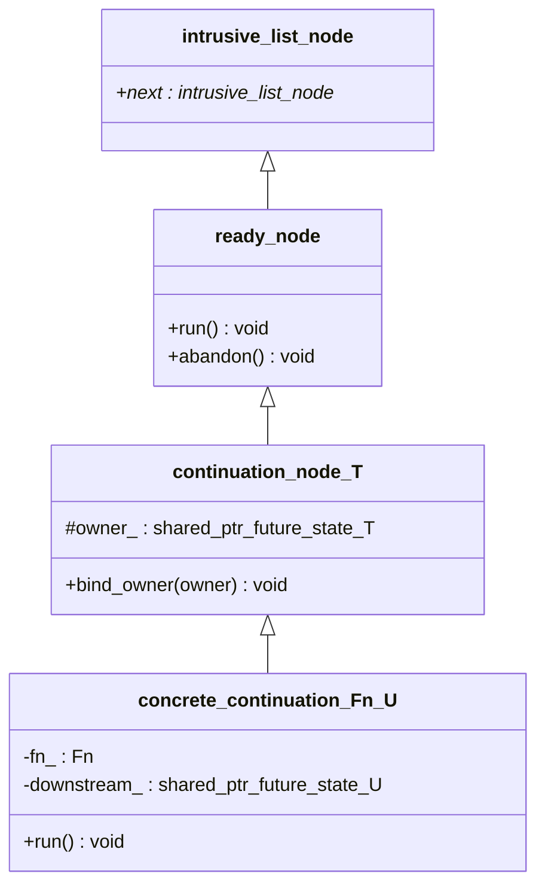

# The continuation node mechanism

This page is a deep dive into how `future<T>::then(fn)` actually gets `fn`
run — the type hierarchy behind it, how a node moves from "registered" to
"run and destroyed," and why the design looks the way it does.

## The type hierarchy

Three layers, each adding exactly what the layer above needs and nothing
more, split across two module partitions:



- `intrusive_list_node` (real name `est::intrusive_list_node`) lives in
  `est:util.intrusive_list` — a genuinely generic utility shared by
  `est::counting_event<Mode>` (which `est::mutex` now builds `lock()` on
  top of directly, rather than keeping a waiter list of its own - issue
  #67), `est::future_state<T>`, and `est::loop` alike (see
  [Architecture](Architecture.md)).
- `ready_node` (real name `est::detail::ready_node`) lives in `est:loop`.
- `continuation_node_T` (real name `est::detail::continuation_node<T>`)
  lives in `est:future`.
- `concrete_continuation_Fn_U` (real name `concrete_continuation<Fn, U>`) is
  a private nested class template *inside* `future_state<T>`, also in
  `est:future`.

(Class names above are simplified to plain identifiers — angle brackets and
namespaces don't render reliably in Mermaid class diagrams — see the code
excerpts below for the real, fully-qualified signatures.)

- **`intrusive_list_node`** (`est:util.intrusive_list`) is nothing but an
  intrusive `next` pointer. It's the root of *three* independent intrusive
  lists in this codebase: `est::counting_event<Mode>`'s own waiter list
  (`est::mutex`'s `lock()` is built directly on top of it, not a separate
  waiter list of its own), and (via
  `ready_node`) both `future_state<T>`'s
  "not yet ready" queue and `est::loop`'s "ready to run" queue. Reusing one
  link field across all of them is safe because a node is only ever a
  member of one such list at a time — see "Node lifecycle" below. The
  accompanying `est::intrusive_list<T>` container (templated so
  `dequeue()` hands back `T*` directly, no cast needed at the call site)
  is what each of the three actually stores its nodes in - see
  [Allocation Patterns](Allocation-Patterns.md) and
  [Architecture](Architecture.md) for more on why this lives in a shared
  util partition instead of inside `est:sync.event`.
- **`ready_node`** (`est:loop`) is the type-erased base the loop's
  ready-queue actually holds. It adds `run()` (invoke whatever this is,
  however it does that), a virtual destructor, and `abandon()` (a hook
  called on a node that never ran, right before it's deleted — see "Node
  lifecycle" below). Deallocation itself is a plain `delete` through this
  base: every concrete node type has its own `operator new`/`operator
  delete` (inherited from `detail::current_allocator_new_delete<T>`,
  `est:util.current_loop` — see that class's own doc comment for why it
  can't instead live on `ready_node` itself), which is what makes that
  safe and correctly sized — see [Allocation Patterns](Allocation-Patterns.md)
  for the full mechanism. `:loop` knows nothing more about what a
  `ready_node` actually *is* — that's the whole point (see
  [Architecture](Architecture.md#why-loop-doesnt-depend-on-future)).
- **`continuation_node<T>`** (`est:future`) is the first T-dependent layer,
  and a thin one: it adds only `owner_` (a `shared_ptr<future_state<T>>`,
  `protected`) and `bind_owner()` to set it — the mechanism that keeps a
  queued node's `future_state<T>` alive; see "The `bind_owner()` subtlety"
  below. It does *not* implement `run()` — that's each concrete node's own
  job now (see the note below on why).
- **`concrete_continuation<Fn, U>`** is a private nested class template
  *inside* `future_state<T>` — one instantiation per distinct
  `(T, Fn, U)` triple a real `.then()` call site produces. It's the layer
  that finally knows the actual callback (`fn_`) and where its result goes
  (`downstream_`, a `shared_ptr<future_state<U>>`). `run()` is implemented
  here, reading `owner_` directly from `continuation_node<T>`.

An earlier version of this hierarchy had `continuation_node<T>` implement
`run()` once, for every `T`, as `invoke(*owner_)`, with each concrete node
instead overriding a second, separately virtual `invoke(future_state<T>&)`.
That bought nothing: the only thing `invoke()` was ever called with was
`*owner_`, so `state` was always just `owner_` read back through a
parameter. It did cost something, though — a second, non-devirtualizable
virtual call (`est::loop`'s ready-queue only ever holds a `ready_node&`, so
`run()`'s own dispatch can't statically know which `invoke()` override it's
about to make a *second* indirect call to) on every single continuation
this framework ever runs. `bind_owner()`/`owner_` stay shared at the
`continuation_node<T>` level regardless — sharing them costs nothing, since
they're a plain data member and a non-virtual setter, not something a
second vtable slot was ever paying for — but `run()` itself now belongs to
each concrete node, which reads `owner_` directly instead of through a
parameter. (Issue #63; see `docs/PLAN.md` for the full writeup.)

## What `then()` actually builds

```cpp
template <detail::then_callback_for<T> Fn> auto then(Fn&& fn) {
  using decayed_fn = std::decay_t<Fn>;
  using downstream_value_type = detail::unwrap_future_t<raw_result_t<decayed_fn>>;
  auto allocator = current_allocator();
  auto downstream = shared_ptr<future_state<downstream_value_type>>::make(allocator);
  auto downstream_for_node = downstream; // copy: the node keeps its own reference too
  using node_type = concrete_continuation<decayed_fn, downstream_value_type>;
  auto* node = new node_type(std::forward<Fn>(fn), std::move(downstream_for_node));
  set_continuation(*node);
  return future<downstream_value_type>(std::move(downstream));
}
```

Only `current_allocator()` is needed to build the downstream state and
its node - `current_loop()` itself is never resolved here;
`set_continuation()` resolves it fresh on its own, only if this
`future_state` already turns out to be ready.

Four things happen, in order:
1. A **new `future_state<U>`** is created (`U` = `downstream_value_type`,
   already resolved through monadic flattening if `Fn` returns a `future<V>`
   — see "Flattening is not a special case" below). This is the state
   behind the `future<U>` `then()` will return to the caller.
2. A **`concrete_continuation<Fn, U>` node** is allocated directly (not
   through `shared_ptr` — see [Allocation Patterns](Allocation-Patterns.md)
   for why), holding `fn` and a `shared_ptr` copy of the new downstream.
3. **`set_continuation(*node)`** registers the node with `this` (the
   *parent* `future_state<T>`, the one `then()` was called on).
4. The caller gets back a `future<U>` wrapping the new downstream — *not*
   the node. The node is now owned entirely by whichever queue it's sitting
   in (see "Node lifecycle").

## Node lifecycle

```mermaid
sequenceDiagram
  participant caller
  participant parent as parent future_state&lt;T&gt;
  participant node as continuation_node&lt;T&gt;
  participant est_loop as est::loop

  caller->>parent: then(fn)
  parent->>node: allocate (holds fn, downstream)
  parent->>parent: set_continuation(node)
  alt not ready yet
    parent->>parent: waiters_.enqueue(node)
    Note over parent,node: node is owned by raw pointer only -<br/>owner_ is still null
    caller->>parent: (later) set_value()/set_exception()
    parent->>parent: complete(): waiters_.dequeue()
  end
  parent->>node: bind_owner(shared_from_this())
  parent->>est_loop: enqueue_ready(node)
  Note over node: node now holds a real shared_ptr<br/>keeping `parent` alive
  est_loop->>est_loop: drain_ready(): ready_.dequeue()
  est_loop->>node: run()
  node->>node: reads *owner_, runs fn_, reports into downstream_
  est_loop->>node: delete [always, via scope_exit guard]
```

Two possible starting states, one converging path:

- **Parent not ready yet.** `set_continuation()` enqueues the node into the
  parent `future_state<T>`'s own `waiters_` list. At this point the node is
  owned *by pointer* by the parent — not by `shared_ptr`. Later, when
  `set_value()`/`set_exception()` runs, `complete()` drains `waiters_` and,
  for each node, calls `bind_owner()` before handing it to
  `loop.enqueue_ready()`.
- **Parent already ready.** `set_continuation()`'s `if (ready())` branch
  takes the same `bind_owner()` + `enqueue_ready()` step immediately,
  skipping `waiters_` entirely.

`waiters_`'s own declared element type is actually `detail::ready_node`
(`est:loop`), not `continuation_node<T>` as the diagram above simplifies
it to - deliberately: `future_state<T>` now inherits `est::ref_counted`
(`est:util.shared_ptr`), so `shared_ptr<future_state<T>>` allocates it
directly rather than through a separate control block, and that in turn
means naming `shared_ptr<future_state<T>>` anywhere requires
`future_state<T>` to already be a complete type. Keying `waiters_` on
`continuation_node<T>` specifically would force exactly that - complete
- while `future_state<T>` is still being defined (its own `waiters_`
member declaration is what would be doing the forcing), a genuine
circular dependency between the two class templates. `ready_node` is
already complete at that point regardless of `T`, so `complete()`
recovers the real `continuation_node<T>&` with a `static_cast` where it
actually needs it (`bind_owner()`) - safe by construction, since
`set_continuation()` is the only thing that ever enqueues anything here,
always a real `continuation_node&`. `future_state<T>`'s own destructor
needs no such downcast: `abandon()`/`delete` both work through the plain
`ready_node&` it already has. See `continuation_node<T>`'s own doc
comment (`future.cppm`) for the full account.

Either way, once a node reaches the loop's ready-queue it's in exactly the
same state: owned by the queue (an intrusive link, no `shared_ptr`) *and*
holding its own `shared_ptr<future_state<T>>` back to its parent. The loop's
`drain_ready()` eventually dequeues it, `run_one()` calls `node.run()`
(one virtual dispatch, straight into the concrete node's own `run()`,
reading `owner_` directly — see the note in "The type hierarchy" above),
and — always, via a `scope_exit`-based guard, whether or not `run()`
somehow threw — `delete` deallocates it, through this concrete node
type's own `operator delete` (see
[Allocation Patterns](Allocation-Patterns.md) for why every concrete node
type needs its own).

### The `bind_owner()` subtlety

`continuation_node<T>` takes its `shared_ptr<future_state<T>>`
owner via a separate `bind_owner()` call, not at construction time.
Taking it at construction would create a reference cycle:

A node still sitting in the parent's own `waiters_` (not yet ready) is
already reachable *from* that same parent, by raw pointer. If it *also* held
a permanent `shared_ptr` back to that parent from the moment it was
constructed, the parent would be counting itself as one of its own owners —
a genuine reference cycle. A `future_state<T>` whose promise and future were
both dropped without ever completing would then never reach a zero ref
count (the node it still owns keeps it artificially alive), so it — and the
node — would leak forever instead of being cleaned up by
`future_state<T>`'s own destructor the normal way.

`bind_owner()` avoids that: called exactly once, right at the moment a node
transitions from "pending, exclusively owned by the parent" to "queued on
the loop, needs to survive independently of the parent's own ref count."
Before that point, no cycle exists (the node has no strong reference to its
parent). After that point, the node is no longer reachable *from* the
parent's own bookkeeping (`waiters_` has already given it up), so the
`shared_ptr` it now holds is a genuine, cycle-free keep-alive — exactly what
prevents the parent `future_state<T>` from being destroyed out from under a
continuation still sitting in the loop's ready-queue, even if every other
`promise`/`future` handle for it has already been dropped.

## The two calling conventions

`run()`'s real body — the part `concrete_continuation<Fn, U>` actually
implements — reads `owner_` (`continuation_node<T>`'s own member) and then
dispatches on how `Fn` can be called, checked in this order:

```cpp
void run() final {
  auto& state = *this->owner_;
  try {
    if constexpr (detail::invocable_unwrapped<Fn, T>()) {
      if (state.failed()) {                        // "unwrapped", auto-propagate
        downstream_->set_exception(state.get_exception());
      } else if constexpr (std::is_void_v<T>) {
        invoke_and_fulfill();                        // "unwrapped", T = void
      } else if constexpr (std::invocable<Fn&, T&&>) {
        if (this->owner_.count() == 1) {
          invoke_and_fulfill(std::move(state).get()); // "unwrapped", sole owner: move
        } else {
          invoke_and_fulfill(state.get());            // "unwrapped", shared: copy/reference
        }
      } else {
        invoke_and_fulfill(state.get());              // "unwrapped", Fn can't take T&&
      }
    } else {
      future<T> view(state.shared_from_this());   // "wrapped"
      invoke_and_fulfill(view);
    }
  } catch (...) {
    downstream_->set_exception(std::current_exception());
  }
}
```

- **Unwrapped** (`Fn` invocable with `const T&`, or with nothing when
  `T = void`): called *only* on success, with the value itself. On failure,
  `Fn` is skipped entirely and the exception is forwarded straight into
  `downstream_` via `get_exception()` — a plain pointer copy, not a
  throw/catch round-trip, since `failed()` already established there's an
  exception waiting. When `Fn` also accepts `T&&` (by value, by `const T&`,
  or by `T&&`/`auto&&` itself — excludes a purely lvalue-bound callback like
  `[](auto& value)`) and this node is the sole `shared_ptr<future_state<T>>`
  owner (`owner_.count() == 1` — no sibling continuation, no live
  `future`/`promise` handle left), `run()` moves the stored value out
  instead of reading a reference into it (issue #64). `future<T>::then(Fn&&)
  &&` exists to make that count come back 1 more often, by dropping the
  caller's own reference before delegating to `future_state<T>::then()`
  (issue #71) — see `future.cppm`.
- **Wrapped** (`Fn` invocable with `future<T>&`): always called, success or
  failure, with a *fresh* `future<T>` view built via `shared_from_this()` —
  never a stored one, since a continuation only ever runs once. `Fn`
  inspects `ready()`/`failed()`/`get()` itself to decide what to do. No
  implicit unwrap, no auto-propagation.

Checked in that order — unwrapped first — so a generic callback (e.g. an
`auto&` lambda, incidentally invocable both ways, since a template
parameter binds to either) defaults to unwrapped. Wrapped is only chosen
when unwrapped genuinely isn't viable: `Fn` explicitly typed to take
`future<T>&` isn't invocable with a plain `const T&`, so it still falls
through to wrapped.

(`invoke_and_fulfill()`/`fulfill()`, called from both branches above, are
`concrete_continuation<Fn, U>`'s own private helpers — see "Flattening is
not a special case" below for `fulfill()`.)

`then_callback_for<Fn, T>` (the concept constraining `then()`'s template
parameter) checks in the identical order, and for a sharper reason than
just matching `run()`'s own precedence:

```cpp
template <class Fn, class T>
concept then_callback_for = invocable_unwrapped<Fn, T>() || std::invocable<Fn&, future<T>&>;
```

Constraint disjunction (`||`) short-circuits left-to-right — whichever
operand is written first is the one actually evaluated for an `Fn` that
satisfies it, the second never even instantiated. That matters here
because the two checks aren't equally safe to attempt: a generic callback
that's only *valid* when called with a plain `T` — one that returns a copy
of its argument, say, which `future<T>`'s deleted copy constructor makes
ill-formed for a `future<T>&` argument — doesn't fail `std::invocable<Fn&,
future<T>&>` gracefully. "Use of a deleted function" isn't an
overload-resolution failure the way "no viable candidate" is, so it isn't
SFINAE-friendly; instantiating that check at all is a hard compile error,
constraint or no constraint. Checking `invocable_unwrapped<Fn, T>()`
first means an `Fn` for which it's satisfied never triggers the wrapped
check at all — the same short-circuiting that decides `run()`'s own
dispatch order is what makes this ordering *necessary* here, not just
consistent. An `Fn` matching neither shape still fails right at the
`then()` call site with a "constraints not satisfied" diagnostic, not
deep inside `run()`'s own
instantiation.

## Flattening is not a special case

When `Fn`'s result is itself a `future<V>`, `then()` doesn't special-case
the node hierarchy at all — `fulfill()`'s `is_future_v` branch registers a
small forwarding node directly on the inner future's own `future_state<U>`,
which reports that inner future's eventual value or exception straight into
the outer `downstream_`:

```cpp
template <class R> void fulfill(R&& result) {
  if constexpr (detail::is_future_v<std::decay_t<R>>) {
    auto* node = new detail::flatten_forwarder<U>(downstream_);
    result.state_->set_continuation(*node);
  } else {
    downstream_->set_value(std::forward<R>(result));
  }
}
```

`result.state_` — `future<U>`'s private `shared_ptr<future_state<U>>`
member — is reached directly, not through any public `future<U>` method:
`future<T>` grants every `future_state<X>` instantiation friendship
(`template <class> friend class future_state;`) precisely so this one call
site, itself nested inside a `future_state<T>` instantiation, can register a
continuation on an *inner* future's state without `future<U>` needing to
expose a method for it at all.

This deliberately doesn't go through `.then()`: `then()` exists to hand
the *caller* a `future<U>` to chain onward from, but this call site has
nowhere to put one — the forwarding logic already reports straight into
the real `downstream_`. Registering via `.then()` anyway would mean
paying for a throwaway `future_state<void>` plus a full
`concrete_continuation<Fn, void>` — with its own wrapped/unwrapped dispatch
and `fulfill()`/`invoke_and_fulfill()` machinery none of it ever needed —
for every single flattening `.then()` call, allocated and freed without
anything ever observing either one. `detail::flatten_forwarder<T>` avoids
all of that: a free class template in `est::detail`, alongside
`continuation_node<T>`, not nested inside `future_state<T>` at all,
registered directly via `set_continuation()`:

```cpp
template <class T>
class flatten_forwarder final : public continuation_node<T>,
                                 public current_allocator_new_delete<flatten_forwarder<T>> {
public:
  explicit flatten_forwarder(shared_ptr<future_state<T>> downstream)
      : downstream_(std::move(downstream)) {}

  void run() final {
    auto& state = *this->owner_;
    if (state.failed()) {
      downstream_->set_exception(state.get_exception());
      return;
    }
    try {
      if constexpr (std::is_void_v<T>) {
        downstream_->set_value();
      } else {
        downstream_->set_value(std::move(state).get());
      }
    } catch (...) {
      downstream_->set_exception(std::current_exception());
    }
  }

  void abandon() noexcept override {
    downstream_->set_exception(std::make_exception_ptr(abandoned_exception()));
  }

private:
  shared_ptr<future_state<T>> downstream_;
};
```

`abandon()` completing `downstream_` with `detail::abandoned_exception`
(`est:loop` - the one shared, message-less exception type every
`abandon()` override in this codebase that needs to actually complete
something throws, rather than one hand-rolled `std::runtime_error`
literal per call site) - rather than leaving it dropped, `ready_node::
abandon()`'s own default no-op body - matters for the same reason
`future_resume_node<T>`'s own doc comment (above) gives: a coroutine
`co_await`-ing the outer `future<T>` this node forwards into holds
`downstream_`'s own `future_state` alive across its own suspension, so
dropping just this node's reference to it without completing it would
strand that coroutine's frame with nothing left to free it. (Originally
left unhandled - "not a settled answer" - until `est::mutex::lock()`'s
own `.then()`-based slow path, `est/src/sync/mutex.cppm`, turned the gap
from theoretical into a real, test-caught leak; see `docs/PLAN.md`'s
"Issue #66 & #67" entry.)

The forwarding logic this node needs is fixed — it never varies by
closure, only by `T` — so `flatten_forwarder<T>` bakes that one shape in
directly: no `Fn` member, no lambda, no `future<T>` view built via
`shared_from_this()` (it operates on `*owner_`, which already exposes
`failed()`/`get_exception()`/`get()` publicly). Every flattening `.then()`
at the same inner value type `T` reuses the *same* `flatten_forwarder<T>`
instantiation, instead of minting a fresh node type per `(T, Fn, U)` call
site — fewer template instantiations overall for a codebase with many
distinct flattening call sites sharing the same inner future type.
`concrete_continuation<Fn, U>` overrides `abandon()` the identical way,
completing its own `downstream_` with the same `detail::abandoned_exception`
instead of leaving it dropped - the same "Issue #66 & #67" fix covers
both classes at once, since both carry the identical hazard.

`run()` moves the inner value out — `std::move(state).get()`, not a
copying `.get()` — since `state` is a fresh, single-owner future_state
(`fn`'s own return value, not a stored one). That move matters beyond
speed: a `future<std::unique_ptr<T>>` returned from a `then()` callback
couldn't be flattened through a copying path at all, since
`std::unique_ptr` has no copy constructor to select.

[Allocation Patterns](Allocation-Patterns.md#flattening-costs-one-extra-allocation)
has the same story from that page's own angle (total allocation counts per
`then()` shape).

## `est::when_all()`: forcing wrapped mode on purpose

`est::when_all(future<Ts>&... futures) -> future<void>` (`est/src/when_all.cppm`,
issue #54) resolves once every one of `futures` is ready, success or
failure - each input stays owned by the caller (`when_all()` only ever
registers a `.then()` continuation on it, never moves or consumes it),
which inspects `failed()`/`get()` on whichever of them it cares about
afterward. Internally, it's a small counting barrier: a shared
`detail::when_all_state{promise<void> result; int remaining;}`, and one
`.then()` registration per input that decrements `remaining` and calls
`result.set_value()` the moment it reaches zero.

The one thing that registration *cannot* be is a generic `[](auto& v)
{...}` lambda, even though that would otherwise be the natural shape for
"run this the same way regardless of `T`." `then_callback_for<T>`'s own
dispatch (`invocable_unwrapped<Fn, T>()`, above) checks unwrapped mode
first - `std::invocable<Fn&, const T&>` - and a generic lambda satisfies
that check too, since a template parameter binds to `const T&` just as
readily as to `future<T>&`. Landing in unwrapped mode is exactly wrong
here: unwrapped mode auto-propagates a failure straight to the
`.then()`-returned future *without ever calling `fn`* (see "The two
calling conventions" above) - so a generic hook would silently never
decrement `remaining` for a failed input, and `when_all()`'s returned
future would simply hang forever the first time any one constituent
failed.

The fix is `detail::when_all_hook<T>()`, a small factory that returns a
lambda explicitly typed on `future<T>&`:

```cpp
template <class T> auto when_all_hook(shared_ptr<when_all_state> state) {
  return [state = std::move(state)](future<T>& /*completed*/) {
    if (--state->remaining == 0) {
      state->result.set_value();
    }
  };
}
```

A `future<T>&` parameter cannot bind a `const T&` argument - they're
unrelated types - so `invocable_unwrapped<Fn, T>()` is false regardless
of `T` (including `T = void`, where the zero-argument unwrapped check
fails for the same reason: this lambda always takes exactly one
argument). Wrapped mode - `std::invocable<Fn&, future<T>&>` - is the only
one left, and it runs unconditionally, success or failure, which is
exactly the completion signal `when_all()` needs. One `when_all_hook<T>()`
instantiation is built per distinct `T` in the input list (or the single
`T` of a `std::span<future<T>>`, for the range-based overload), each
capturing its own copy of the same `shared_ptr<when_all_state>` - the
node that copy ends up living in, per that future's own `.then()` call,
is what keeps `when_all_state` alive until every one of them has run
(or been abandoned - `concrete_continuation<Fn, U>`'s own `abandon()`
override, discussed above, means a `when_all()` call whose loop tears
down before every input completes still frees its shared state and every
hook cleanly, rather than leaking).
