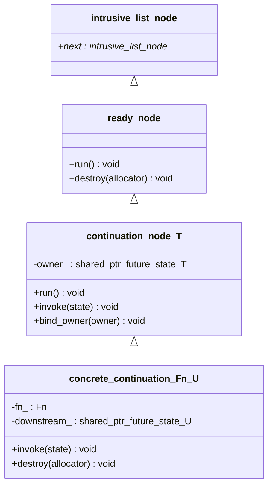

# The continuation node mechanism

This page is a deep dive into how `future<T>::then(fn)` actually gets `fn`
run — the type hierarchy behind it, how a node moves from "registered" to
"run and destroyed," and why the design looks the way it does.

## The type hierarchy

Three layers, each adding exactly what the layer above needs and nothing
more, split across two module partitions:



- `intrusive_list_node` (real name `est::intrusive_list_node`) lives in
  `est:util.intrusive_list` — a genuinely generic utility, not something
  borrowed from `est::mutex`; `est::mutex`'s own `mutex_waiter` is just an
  alias for it (see [Architecture](Architecture.md)).
- `ready_node` (real name `est::detail::ready_node`) lives in `est:loop`.
- `continuation_node_T` (real name `est::detail::continuation_node<T>`)
  lives in `est:future`.
- `concrete_continuation_Fn_U` (real name `concrete_continuation<Fn, U>`) is
  a private nested class template *inside* `future_state<T>`, also in
  `est:future`.

(Class names above are simplified to plain identifiers — angle brackets and
namespaces don't render reliably in Mermaid class diagrams — see the code
excerpts below for the real, fully-qualified signatures.)

- **`intrusive_list_node`** (`est:util.intrusive_list`) is nothing but an
  intrusive `next` pointer. It's the root of *three* independent intrusive
  lists in this codebase: `est::mutex`'s own waiter list (via the
  `mutex_waiter` alias), and (via `ready_node`) both `future_state<T>`'s
  "not yet ready" queue and `est::loop`'s "ready to run" queue. Reusing one
  link field across all of them is safe because a node is only ever a
  member of one such list at a time — see "Node lifecycle" below. The
  accompanying `est::intrusive_list<T>` container (templated so
  `dequeue()` hands back `T*` directly, no cast needed at the call site)
  is what each of the three actually stores its nodes in - see
  [Allocation Patterns](Allocation-Patterns.md) and
  [Architecture](Architecture.md) for more on why this lives in a shared
  util partition instead of inside `est:sync.mutex`.
- **`ready_node`** (`est:loop`) is the type-erased base the loop's
  ready-queue actually holds. It adds exactly two things: `run()` (invoke
  whatever this is, however it does that) and `destroy(allocator)`
  (deallocate through the *actual* derived type — see
  [Allocation Patterns](Allocation-Patterns.md) for why this can't just be a
  plain destructor call). `:loop` knows nothing more about what a
  `ready_node` actually *is* — that's the whole point (see
  [Architecture](Architecture.md#why-loop-doesnt-depend-on-future)).
- **`continuation_node<T>`** (`est:future`) is the first T-dependent layer.
  It adds `invoke(future_state<T>&)` (still pure virtual — a concrete `Fn`
  hasn't entered the picture yet) and implements `run()` *once*, for every
  `T`, by forwarding to `invoke(*owner_)`. It also owns `bind_owner()` and
  the `owner_` member — the mechanism that keeps a queued node's
  `future_state<T>` alive; see "The `bind_owner()` subtlety" below.
- **`concrete_continuation<Fn, U>`** is a private nested class template
  *inside* `future_state<T>` — one instantiation per distinct
  `(T, Fn, U)` triple a real `.then()` call site produces. It's the layer
  that finally knows the actual callback (`fn_`) and where its result goes
  (`downstream_`, a `shared_ptr<future_state<U>>`). `invoke()` and
  `destroy()` are implemented here, nowhere else.

Only `run()` gets a single shared implementation at the `continuation_node<T>`
level instead of being repeated once per `(Fn, U)` instantiation — this is a
deliberate compile-time-cost optimization, the same "compiled once instead
of once per T" reasoning `ready_node` itself exists for.

## What `then()` actually builds

```cpp
template <detail::then_callback_for<T> Fn> auto then(Fn&& fn) {
  using decayed_fn = std::decay_t<Fn>;
  using downstream_value_type = detail::unwrap_future_t<raw_result_t<decayed_fn>>;
  auto downstream =
      shared_ptr<future_state<downstream_value_type>>::make(loop_.allocator(), loop_);
  auto downstream_for_node = downstream; // copy: the node keeps its own reference too
  using node_type = concrete_continuation<decayed_fn, downstream_value_type>;
  auto* node = loop_.allocator().template new_object<node_type>(std::forward<Fn>(fn),
                                                                 std::move(downstream_for_node));
  set_continuation(*node);
  return future<downstream_value_type>(std::move(downstream));
}
```

Four things happen, in order:
1. A **new `future_state<U>`** is created (`U` = `downstream_value_type`,
   already resolved through monadic flattening if `Fn` returns a `future<V>`
   — see "Flattening is not a special case" below). This is the state
   behind the `future<U>` `then()` will return to the caller.
2. A **`concrete_continuation<Fn, U>` node** is allocated directly (not
   through `shared_ptr` — see [Allocation Patterns](Allocation-Patterns.md)
   for why), holding `fn` and a `shared_ptr` copy of the new downstream.
3. **`set_continuation(*node)`** registers the node with `this` (the
   *parent* `future_state<T>`, the one `then()` was called on).
4. The caller gets back a `future<U>` wrapping the new downstream — *not*
   the node. The node is now owned entirely by whichever queue it's sitting
   in (see "Node lifecycle").

## Node lifecycle

```mermaid
sequenceDiagram
  participant caller
  participant parent as parent future_state&lt;T&gt;
  participant node as continuation_node&lt;T&gt;
  participant est_loop as est::loop

  caller->>parent: then(fn)
  parent->>node: allocate (holds fn, downstream)
  parent->>parent: set_continuation(node)
  alt not ready yet
    parent->>parent: waiters_.enqueue(node)
    Note over parent,node: node is owned by raw pointer only -<br/>owner_ is still null
    caller->>parent: (later) set_value()/set_exception()
    parent->>parent: complete(): waiters_.dequeue()
  end
  parent->>node: bind_owner(shared_from_this())
  parent->>est_loop: enqueue_ready(node)
  Note over node: node now holds a real shared_ptr<br/>keeping `parent` alive
  est_loop->>est_loop: drain_ready(): ready_.dequeue()
  est_loop->>node: run() -> invoke(*owner_)
  node->>node: runs fn_, reports into downstream_
  est_loop->>node: destroy(allocator) [always, via scope_exit guard]
```

Two possible starting states, one converging path:

- **Parent not ready yet.** `set_continuation()` enqueues the node into the
  parent `future_state<T>`'s own `waiters_` list. At this point the node is
  owned *by pointer* by the parent — not by `shared_ptr`. Later, when
  `set_value()`/`set_exception()` runs, `complete()` drains `waiters_` and,
  for each node, calls `bind_owner()` before handing it to
  `loop.enqueue_ready()`.
- **Parent already ready.** `set_continuation()`'s `if (ready())` branch
  takes the same `bind_owner()` + `enqueue_ready()` step immediately,
  skipping `waiters_` entirely.

Either way, once a node reaches the loop's ready-queue it's in exactly the
same state: owned by the queue (an intrusive link, no `shared_ptr`) *and*
holding its own `shared_ptr<future_state<T>>` back to its parent. The loop's
`drain_ready()` eventually dequeues it, `run_one()` calls `node.run()`
(dispatching through `continuation_node<T>::run()` to `invoke(*owner_)`),
and — always, via a `scope_exit`-based guard, whether or not `run()`
somehow threw — `node.destroy(allocator)` deallocates it.

### The `bind_owner()` subtlety

`continuation_node<T>` could have taken its `shared_ptr<future_state<T>>`
owner at *construction* time instead of via a separate `bind_owner()` call
later. An earlier draft of this design did exactly that — and it was a real
bug, caught during review before it shipped:

A node still sitting in the parent's own `waiters_` (not yet ready) is
already reachable *from* that same parent, by raw pointer. If it *also* held
a permanent `shared_ptr` back to that parent from the moment it was
constructed, the parent would be counting itself as one of its own owners —
a genuine reference cycle. A `future_state<T>` whose promise and future were
both dropped without ever completing would then never reach a zero ref
count (the node it still owns keeps it artificially alive), so it — and the
node — would leak forever instead of being cleaned up by
`future_state<T>`'s own destructor the normal way.

The fix is `bind_owner()`, called exactly once, right at the moment a node
transitions from "pending, exclusively owned by the parent" to "queued on
the loop, needs to survive independently of the parent's own ref count."
Before that point, no cycle exists (the node has no strong reference to its
parent). After that point, the node is no longer reachable *from* the
parent's own bookkeeping (`waiters_` has already given it up), so the
`shared_ptr` it now holds is a genuine, cycle-free keep-alive — exactly what
prevents the parent `future_state<T>` from being destroyed out from under a
continuation still sitting in the loop's ready-queue, even if every other
`promise`/`future` handle for it has already been dropped.

## The two calling conventions

`invoke()`'s real body — the part `concrete_continuation<Fn, U>` actually
implements — dispatches on how `Fn` can be called, checked in this order
(precedence changed by issue #39 — see below):

```cpp
void invoke(future_state& state) override {
  try {
    if constexpr (detail::invocable_unwrapped<Fn, T>()) {
      if (state.failed()) {                        // "unwrapped", auto-propagate
        downstream_->set_exception(state.get_exception());
      } else if constexpr (std::is_void_v<T>) {
        invoke_and_fulfill();                        // "unwrapped", T = void
      } else {
        invoke_and_fulfill(state.get());              // "unwrapped", T != void
      }
    } else {
      future<T> view(state.shared_from_this());   // "wrapped"
      invoke_and_fulfill(view);
    }
  } catch (...) {
    downstream_->set_exception(std::current_exception());
  }
}
```

- **Unwrapped** (`Fn` invocable with `const T&`, or with nothing when
  `T = void`): called *only* on success, with the value itself. On failure,
  `Fn` is skipped entirely and the exception is forwarded straight into
  `downstream_` via `get_exception()` — a plain pointer copy, not a
  throw/catch round-trip, since `failed()` already established there's an
  exception waiting.
- **Wrapped** (`Fn` invocable with `future<T>&`): always called, success or
  failure, with a *fresh* `future<T>` view built via `shared_from_this()` —
  never a stored one, since a continuation only ever runs once. `Fn`
  inspects `ready()`/`failed()`/`get()` itself to decide what to do. No
  implicit unwrap, no auto-propagation.

Checked in that order — unwrapped first — so a generic callback (e.g. an
`auto&` lambda, incidentally invocable both ways, since a template
parameter binds to either) defaults to unwrapped. Wrapped is only chosen
when unwrapped genuinely isn't viable: `Fn` explicitly typed to take
`future<T>&` isn't invocable with a plain `const T&`, so it still falls
through to wrapped exactly as before — the precedence change only affects
callbacks generic enough to accept both shapes, flipping which one they
get by default. (An earlier version of this code checked wrapped first,
so a generic lambda like this silently got wrapped, no-unwrap behavior
without opting into it — found and reported as issue #39.)

`then_callback_for<Fn, T>` (the concept constraining `then()`'s template
parameter) needed the identical reordering, and for a sharper reason than
just matching `invoke()`'s own precedence:

```cpp
template <class Fn, class T>
concept then_callback_for = invocable_unwrapped<Fn, T>() || std::invocable<Fn&, future<T>&>;
```

Constraint disjunction (`||`) short-circuits left-to-right — whichever
operand is written first is the one actually evaluated for an `Fn` that
satisfies it, the second never even instantiated. That matters here
because the two checks aren't equally safe to attempt: a generic callback
that's only *valid* when called with a plain `T` — one that returns a copy
of its argument, say, which `future<T>`'s deleted copy constructor makes
ill-formed for a `future<T>&` argument — doesn't fail `std::invocable<Fn&,
future<T>&>` gracefully. "Use of a deleted function" isn't an
overload-resolution failure the way "no viable candidate" is, so it isn't
SFINAE-friendly; instantiating that check at all is a hard compile error,
constraint or no constraint. With the wrapped shape checked first (as an
earlier version of this concept had it), such an `Fn` failed to compile
outright. Checking `invocable_unwrapped<Fn, T>()` first means an `Fn` for
which it's satisfied never triggers the wrapped check at all — the same
short-circuiting that makes the precedence change effective for dispatch
is what makes it *necessary* here, not just consistent. An `Fn` matching
neither shape still fails right at the `then()` call site with a
"constraints not satisfied" diagnostic, not deep inside `invoke()`'s own
instantiation.

## Flattening is not a special case

When `Fn`'s result is itself a `future<V>`, `then()` doesn't special-case
the node hierarchy at all — `fulfill()`'s `is_future_v` branch just calls
`.then()` *again*, on the inner future, registering an ordinary wrapped
continuation that forwards the inner result into the outer `downstream_`:

```cpp
template <class R> void fulfill(R&& result) {
  if constexpr (detail::is_future_v<std::decay_t<R>>) {
    using inner_value_type = detail::unwrap_future_t<std::decay_t<R>>;
    auto downstream_copy = downstream_;
    std::forward<R>(result).then([downstream_copy](future<inner_value_type>& inner_future) {
      if (inner_future.failed()) {
        downstream_copy->set_exception(inner_future.get_exception());
        return;
      }
      // ...forward the value (or a thrown exception while copying it)...
    });
  } else {
    downstream_->set_value(std::forward<R>(result));
  }
}
```

That nested `.then()` call goes through *exactly* the same `then()`
implementation described above — a new `concrete_continuation` gets
allocated for the forwarding lambda, a new (throwaway) downstream
`future_state` gets created for it, and it defers to `est::loop` exactly
like any other continuation. This is elegant (no special-cased node type
for flattening) but not free: it's the direct cause of the extra
allocations a flattening `.then()` costs, documented in
[Allocation Patterns](Allocation-Patterns.md#flattening-costs-two-extra-allocations)
and tracked as a known inefficiency in
[issue #25](https://github.com/andijcr/async_experiments/issues/25).
